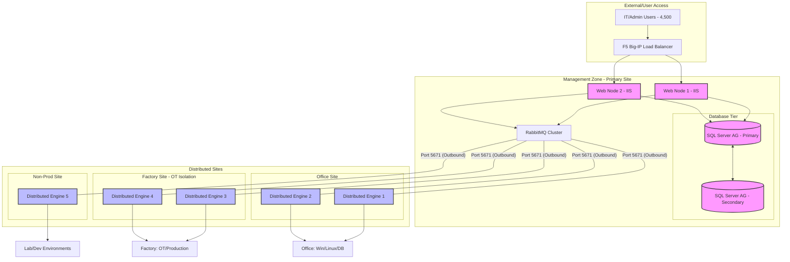

```mermaid
graph TD
    subgraph External_User_Access [External/User Access]
        U[IT/Admin Users - 4,500] --> F5[F5 Big-IP Load Balancer]
    end

    subgraph Management_Zone [Management Zone - Primary Site]
        F5 --> W1[Web Node 1 - IIS]
        F5 --> W2[Web Node 2 - IIS]
        W1 & W2 --> RMQ[RabbitMQ Cluster]
        
        subgraph Database_Tier [Database Tier]
            DB1[(SQL Server AG - Primary)] <--> DB2[(SQL Server AG - Secondary)]
        end
        
        W1 & W2 --> DB1
    end

    subgraph Distributed_Sites [Distributed Sites]
        subgraph Office_Site [Office Site]
            DE_Off1[Distributed Engine 1]
            DE_Off2[Distributed Engine 2]
        end

        subgraph Factory_Site [Factory Site - OT Isolation]
            DE_Fac1[Distributed Engine 3]
            DE_Fac2[Distributed Engine 4]
        end

        subgraph Non_Prod_Site [Non-Prod Site]
            DE_NP1[Distributed Engine 5]
        end
    end

    %% Connection Logic
    RMQ -- "Port 5671 (Outbound)" --- DE_Off1
    RMQ -- "Port 5671 (Outbound)" --- DE_Off2
    RMQ -- "Port 5671 (Outbound)" --- DE_Fac1
    RMQ -- "Port 5671 (Outbound)" --- DE_Fac2
    RMQ -- "Port 5671 (Outbound)" --- DE_NP1
    
    %% Target Endpoints
    DE_Off1 & DE_Off2 --> Off_T[Office: Win/Linux/DB]
    DE_Fac1 & DE_Fac2 --> Fac_T[Factory: OT/Production]
    DE_NP1 --> NP_T[Lab/Dev Environments]

    classDef primary fill:#f9f,stroke:#333,stroke-width:2px;
    classDef engine fill:#bbf,stroke:#333,stroke-width:2px;
    
    class W1,W2,DB1,DB2 primary;
    class DE_Off1,DE_Off2,DE_Fac1,DE_Fac2,DE_NP1 engine;
```
